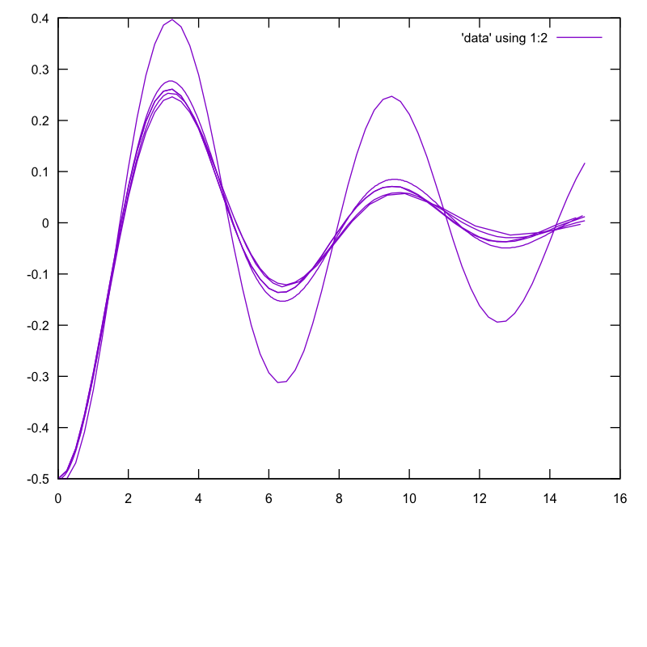

Spring Calculations 
===================

See [my physics lab](http://www.myphysicslab.com/spring1.html)

    $ go run spring.go > data
    $ gnuplot -p -e "set term svg; set output 'plot.svg'; plot 'data' using 1:2 with linespoints"
